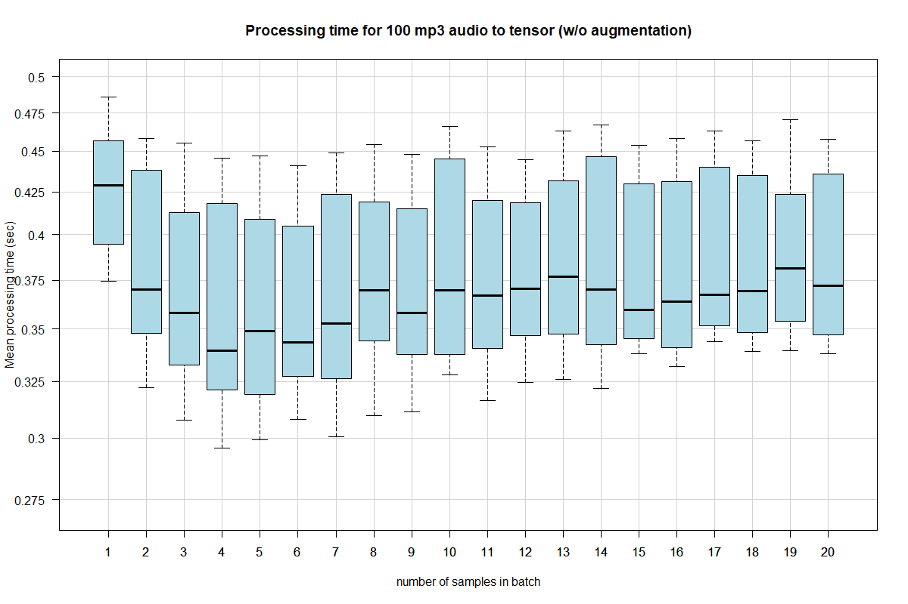
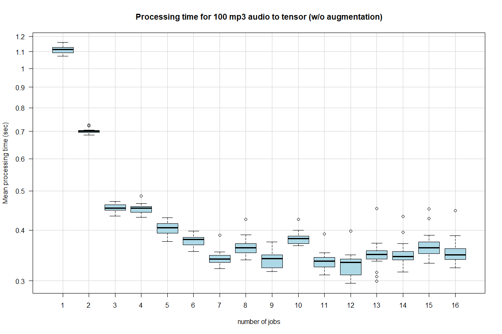

# Data Loading for Wav2Vec
Experimenting with custom data loaders for wav2vec2 training:
Goals:
* convert mp3 to PCM in memory (no file IO)
* apply audio agumentation in memory
* cache data - as much as possible  
* don't use tqdm - as minimal stdout usage as possible 

# Experiments 

## Experiment 1
* [exp1-parallel-audio-loader.py](src/exp1-parallel-audio-loader.py)
* data loader: loads mp3 converts to PCM to torch tensor
* single iteration of an epoch of data in batches 
* data: 
  * 100 mp3 files as tensors
  * variable number of processes (1-16) (16 cores on the running PC)
  * variable batch size (1-20)

### Results




Notes:
* avoid single process data loading -> it is the slowest
* increasing num of workers beyond a point won't improve speed 
  * torch documentation suggest number of physical cores 
  * but the exact number of workers depends on several other factors


### How many processes?
* how many data loader workers to be selected?   
* it depends... 
   * processing duration within each dataloader (load and collate)
   * speed of IO: wherever the data comes from (local FS, NFS/SMB mount)
   * number of physical CPU cores in the system
   * GPU processing time of a batch
* advice: try it yourself 

### What batch size?
* must be set in a way to maximize GPU utilization - without out-of-memory errors

# Install
## GSTreamer for Python  
* DOES *NOT* install out of the box
* both system and Python dependencies must be installed carefully
* the following setup worked for me (WSL/Ubuntu 24.04)
```bash 
sudo apt  install gstreamer1.0-tools \
                  gstreamer1.0-plugins-{base,good,bad,ugly} \
                  gstreamer1.0-libav \
                  gir1.2-gst-1.0
```

```bash
# works
pip install pygobject==3.50.0
pip install PyGObject-stubs==2.13.0

# fails: pip install pygobject
```


